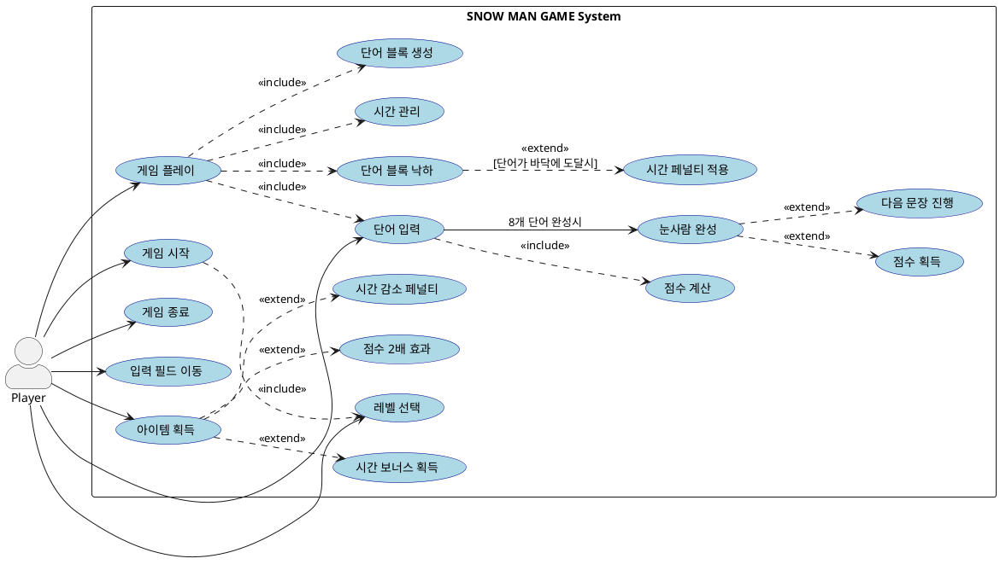
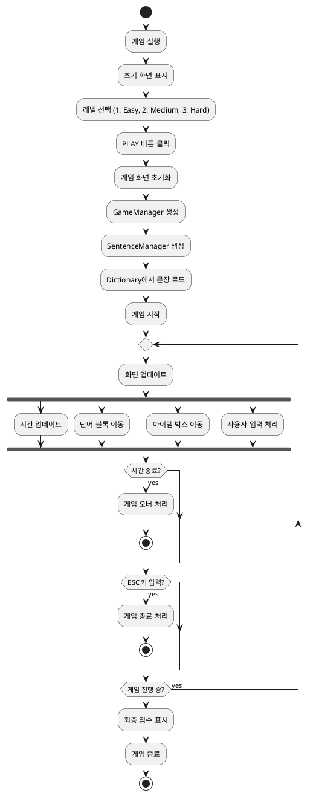
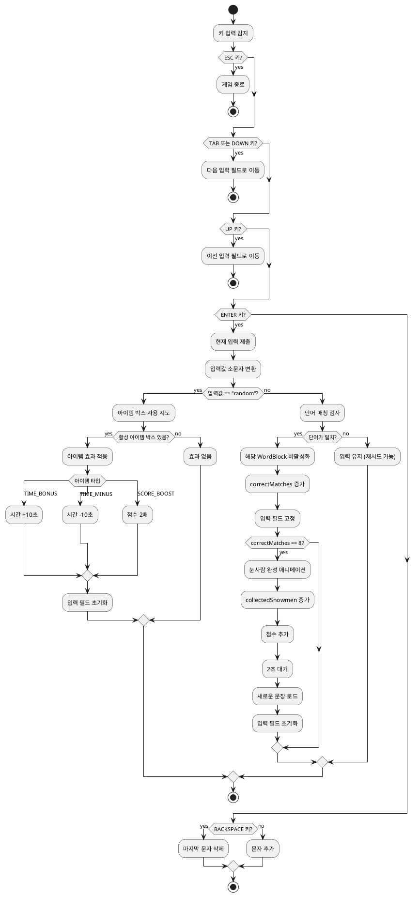
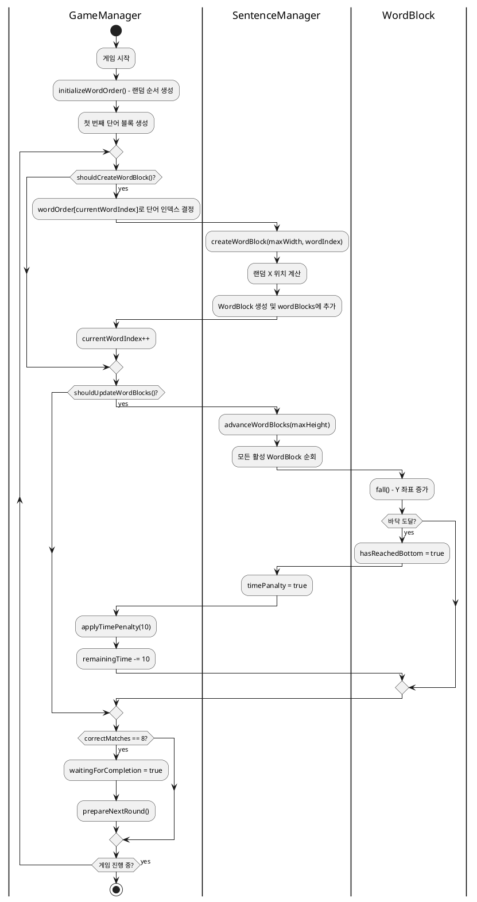
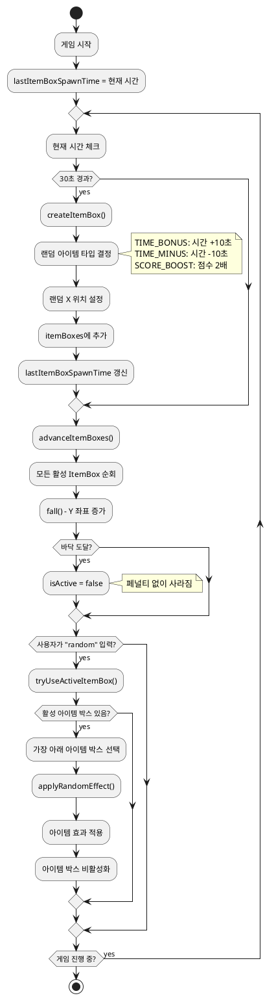

# SNOW MAN GAME - UML 모델링 문서

## 프로젝트 개요
눈사람 만들기 타이핑 게임 - C++ ncurses 기반 콘솔 게임

---

## 1. Class Diagram (클래스 다이어그램)

```plantuml
@startuml ClassDiagram

skinparam classAttributeIconSize 0
skinparam linetype ortho

' =============================================
' 추상 클래스
' =============================================
abstract class Screen {
    + {abstract} UpdateScreen(): void
    + {abstract} resizeScreen(): void
    + {abstract} shapeScreen(): void
}

abstract class FallingObject {
    # x: int
    # y: int
    # initialX: int
    # initialY: int
    # isActive: bool
    # fallSpeed: double
    # gameAreaWidth: int
    # gameAreaHeight: int
    # hasReachedBottom: bool
    --
    + FallingObject(areaWidth: int, areaHeight: int, speed: double)
    + {abstract} draw(): void
    + fall(): void
    + getX(): int
    + getY(): int
    + getIsActive(): bool
    + getHasReachedBottom(): bool
    + setPosition(newX: int, newY: int): void
    + setActive(active: bool): void
    + setFallSpeed(speed: double): void
    + reset(): void
    + checkAndResetBottomReached(): bool
    - {static} initRandomSeed(): void
}

' =============================================
' 화면 클래스들 (Screen 상속)
' =============================================
class InitialScreen {
    - selectedLevel: int
    - playButtonPressed: bool
    --
    + InitialScreen()
    + ~InitialScreen()
    + UpdateScreen(): void
    + resizeScreen(): void
    + shapeScreen(): void
    + runInitialScreen(): void
}

class PlayScreen {
    - currentLevel: int
    - gameWidth: int
    - gameHeight: int
    - gameRunning: bool
    - gameAreaWidth: int
    - scoreAreaWidth: int
    - gameManager: GameManager*
    - sentenceManager: SentenceManager*
    - snowmanCompleted: bool
    - snowmanCompletedTime: time_t
    - showCompletedSnowman: bool
    --
    + PlayScreen(level: int)
    + ~PlayScreen()
    + UpdateScreen(): void
    + resizeScreen(): void
    + shapeScreen(): void
    + runPlayScreen(): void
    - drawFrame(): void
    - drawBigSnowman(y: int, x: int, isComplete: bool): void
    - drawLifeSnowmen(y: int, x: int, count: int): void
    - drawInfoPanel(): void
    - drawInputArea(): void
    - drawBackgroundEffect(): void
    - resizeTerminal(width: int, height: int): void
}

' =============================================
' 게임 로직 클래스들
' =============================================
class GameManager {
    - totalScore: int
    - snowflakeScore: int
    - targetScore: int
    - timeBonus: int
    - levelBonus: int
    - timePenaltySeconds: int
    - timeAdjustment: int
    - scoreMultiplier: int
    - lastItemEffectMessage: string
    - lastItemEffectTime: time_t
    - collectedSnowmen: int
    - startTime: time_t
    - timeLimit: int
    - remainingTime: int
    - timeUp: bool
    - currentLevel: int
    - gameRunning: bool
    - lastWordRenderTime: time_t
    - lastWordCreateTime: time_t
    - wordRenderInterval: int
    - wordCreateInterval: double
    - currentWordIndex: int
    - waitingForCompletion: bool
    - wordOrder: vector<int>
    --
    + GameManager(level: int)
    + initializeWordOrder(): void
    + startGame(sentencemanager: SentenceManager*): void
    + updateTime(): void
    + addSnowflakeScore(): void
    + addTargetScore(): void
    + applyTimePenalty(seconds: int): void
    + calculateTimeBonus(): void
    + updateTotalScore(): void
    + getTotalScore(): int
    + getRemainingTime(): int
    + getFormattedTime(): string
    + endGame(): void
    + checkGameEnd(): bool
    + shouldUpdateWordBlocks(): bool
    + shouldCreateWordBlock(): bool
    + handleWordGeneration(sentenceManager: SentenceManager*): bool
    + notifySnowmanComplete(): void
    + prepareNextRound(sentenceManager: SentenceManager*): void
    + applyItemEffect(type: ItemType): void
    + getCurrentWordIndex(): int
    + shouldDisplayItemEffect(durationSeconds: double): bool
    + getLastItemEffectMessage(): string
    + isWaitingForCompletion(): bool
    + getCollectedSnowmen(): int
    + isTimeUp(): bool
    + isGameRunning(): bool
}

class SentenceManager {
    - inputHandler: InputHandler*
    - dictionary: Dictionary*
    - targetWords: vector<string>
    - correctMatches: int
    - wordBlocks: vector<WordBlock>
    - wordAreaWidth: int
    - currentLevel: int
    - currentSentenceIndex: int
    - timePanalty: bool
    - itemBoxes: vector<ItemBox>
    - lastItemBoxSpawnTime: time_t
    - {static} ITEMBOX_INTERVAL: double
    --
    + SentenceManager(level: int)
    + ~SentenceManager()
    + loadSentenceForLevel(level: int, sentenceIndex: int): void
    + loadRandomSentence(level: int): void
    + checkAnswers(): void
    + createWordBlock(maxWidth: int, wordIndex: int): void
    + createItemBox(maxWidth: int, maxHeight: int): void
    + advanceItemBoxes(maxHeight: int): void
    + spawnItemBoxIfNeeded(maxWidth: int, maxHeight: int): void
    + tryUseActiveItemBox(typeOut: ItemType&): bool
    + advanceWordBlocks(maxHeight: int): void
    + getWordBlocks(): vector<WordBlock>&
    + getItemBoxes(): vector<ItemBox>&
    + getScore(): int
    + getInputHandler(): InputHandler*
    + getTargetWords(): vector<string>&
    + getCorrectMatches(): int
    + getFullSentence(): string
    + getDictionary(): Dictionary*
    + getTimePanalty(): bool
    + setTimePanalty(result: bool): void
}

class Dictionary {
    - levelSentences: map<int, vector<string>>
    - currentWords: vector<string>
    - currentLevel: int
    - currentSentenceIndex: int
    --
    + Dictionary()
    + ~Dictionary()
    + initializeSentences(): void
    + getSentenceCount(level: int): int
    + getWordsForLevel(level: int, sentenceIndex: int): vector<string>
    + getFullSentence(level: int, sentenceIndex: int): string
    + getCurrentWords(): vector<string>&
    + getRandomSentenceWords(level: int): vector<string>
    + getCurrentLevel(): int
    + getCurrentSentenceIndex(): int
    - splitSentenceIntoWords(sentence: string): vector<string>
    - initRandomSeed(): void
}

class InputHandler {
    - userInputs: vector<string>
    - currentInputIndex: int
    - currentInput: string
    - {static} MAX_INPUTS: int
    - {static} MAX_INPUT_LENGTH: int
    - inputComplete: bool
    --
    + InputHandler()
    + handleInput(key: int): bool
    + resetInputs(): void
    + nextInput(): void
    + previousInput(): void
    + getUserInputs(): vector<string>&
    + getCurrentInputIndex(): int
    + getCurrentInput(): string&
    + isInputComplete(): bool
    + allInputsComplete(): bool
    + getCompletedInputsCount(): int
    + isWordCorrect(index: int, target: string): bool
    + clearInput(index: int): void
    + getInputAt(index: int): string
}

' =============================================
' 게임 객체 클래스들 (FallingObject 상속)
' =============================================
class WordBlock {
    - text: string
    - orderIndex: int
    - isInInput: bool
    + active: bool
    + word: string
    --
    + WordBlock()
    + WordBlock(word: string, order: int, areaWidth: int, areaHeight: int, speed: double)
    + draw(): void
    + fall(): void
    + reset(): void
    + enteredInInput(): void
    + deletedInput(): void
    + getText(): string&
    + getOrderIndex(): int
    + getIsInInput(): bool
    + matchesWord(input: string): bool
}

class ItemBox {
    - itemType: ItemType
    - fallAccumulator: double
    --
    + ItemBox(areaWidth: int, areaHeight: int, speed: double)
    + fall(): void
    + draw(): void
    + applyRandomEffect(): ItemType
    + getItemType(): ItemType
    + getEffectDescription(): string
}

enum ItemType <<enumeration>> {
    TIME_BONUS
    TIME_MINUS
    SCORE_BOOST
}

' =============================================
' 관계 정의
' =============================================

' 상속 관계
Screen <|-- InitialScreen
Screen <|-- PlayScreen
FallingObject <|-- WordBlock
FallingObject <|-- ItemBox

' 연관/합성 관계
PlayScreen *-- GameManager : contains
PlayScreen *-- SentenceManager : contains
SentenceManager *-- InputHandler : contains
SentenceManager *-- Dictionary : contains
SentenceManager o-- WordBlock : manages
SentenceManager o-- ItemBox : manages
ItemBox -- ItemType : uses

' 의존 관계
InitialScreen ..> PlayScreen : creates
GameManager ..> SentenceManager : uses
GameManager ..> ItemType : uses

@enduml
```



---

## 2. Use-Case Diagram (유스케이스 다이어그램)



### Use-Case 설명

| Use-Case | 설명 |
|----------|------|
| **게임 시작** | 플레이어가 게임을 시작함 |
| **레벨 선택** | Easy/Medium/Hard 중 난이도 선택 |
| **게임 플레이** | 실제 게임 진행 |
| **게임 종료** | ESC 또는 시간 종료로 게임 종료 |
| **단어 입력** | 떨어지는 단어를 타이핑하여 입력 |
| **입력 필드 이동** | TAB/방향키로 입력창 간 이동 |
| **아이템 획득** | 'random' 입력으로 아이템 사용 |
| **눈사람 완성** | 8개 단어 모두 정확히 입력 |
| **시간 페널티 적용** | 단어가 바닥에 떨어지면 -10초 |
| **점수 2배 효과** | 아이템으로 점수 배율 증가 |

---

## 3. Activity Diagram (활동 다이어그램)

### 3.1 전체 게임 흐름 Activity Diagram



### 3.2 단어 입력 처리 Activity Diagram



### 3.3 단어 블록 생성 및 낙하 Activity Diagram



### 3.4 아이템 박스 시스템 Activity Diagram



---

## 4. 클래스 관계 요약

### 상속 관계 (Inheritance)
- `Screen` ← `InitialScreen`, `PlayScreen`
- `FallingObject` ← `WordBlock`, `ItemBox`

### 합성 관계 (Composition)
- `PlayScreen` ◆─ `GameManager` (PlayScreen이 소멸되면 함께 소멸)
- `PlayScreen` ◆─ `SentenceManager`
- `SentenceManager` ◆─ `InputHandler`
- `SentenceManager` ◆─ `Dictionary`

### 집합 관계 (Aggregation)
- `SentenceManager` ◇─ `WordBlock` (여러 개 관리)
- `SentenceManager` ◇─ `ItemBox` (여러 개 관리)

### 의존 관계 (Dependency)
- `InitialScreen` ─→ `PlayScreen` (생성)
- `GameManager` ─→ `SentenceManager` (사용)
- `GameManager` ─→ `ItemBox::ItemType` (아이템 효과 적용)

---

## 5. 주요 설계 패턴

### 1. Template Method Pattern
- `Screen` 추상 클래스가 `UpdateScreen()`, `resizeScreen()`, `shapeScreen()` 메서드를 정의
- 하위 클래스들이 구체적인 구현 제공

### 2. Strategy Pattern (부분적)
- `FallingObject`의 `fall()` 메서드를 하위 클래스에서 오버라이드
- `WordBlock`과 `ItemBox`가 각각 다른 낙하 동작 구현

### 3. Factory-like 생성
- `PlayScreen`이 `GameManager`와 `SentenceManager` 객체 생성 담당
- `SentenceManager`가 `WordBlock`과 `ItemBox` 객체 생성 담당

---

## 6. 파일 구조

```
OOP_FinalProject/
├── main.cpp              # 진입점
├── interface.h           # Screen, InitialScreen, PlayScreen
├── GameManger.h          # GameManager 클래스
├── SentenceManager.h/.cpp # SentenceManager, InputHandler
├── Dictionary.h/.cpp     # Dictionary 클래스
├── FallingObject.h       # FallingObject 추상 클래스
├── WordBlock.h           # WordBlock 클래스
├── ItemBox.h             # ItemBox 클래스, ItemType enum
└── docs/
    └── UML_Diagrams.md   # 본 문서
```
